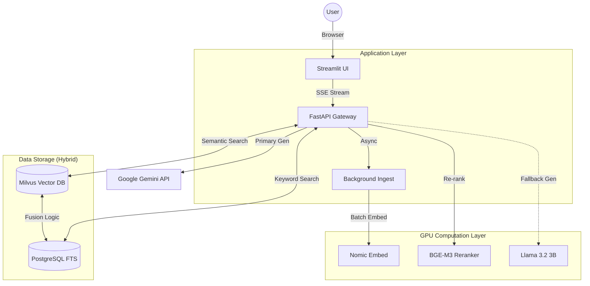
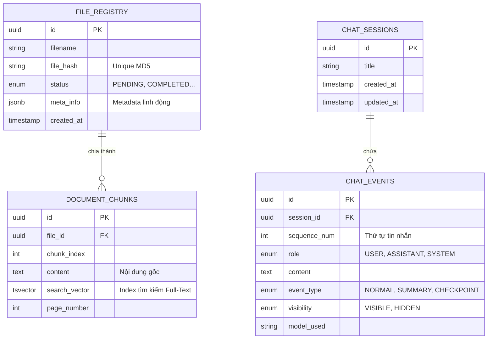
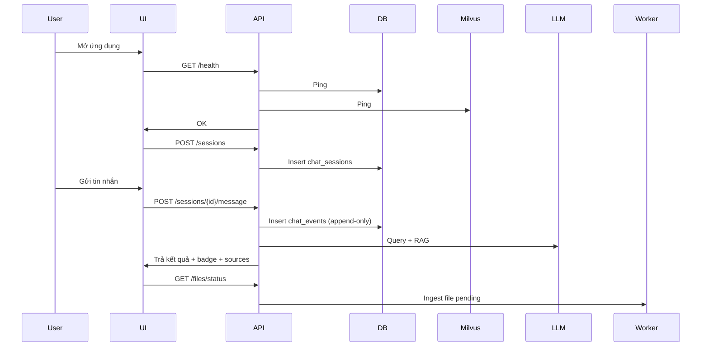

-----

# 📘 HỒ SƠ THIẾT KẾ: RAG V2 ULTIMATE


**Mô hình:** Microservices / Hybrid Search / GPU-Accelerated


-----

## 1\. TỔNG QUAN HỆ THỐNG (System Overview)

### 1.1. Mục tiêu

Xây dựng một hệ thống **Trợ lý AI Tài chính** có khả năng:

1.  **Hiểu sâu tài liệu:** Tra cứu chính xác trong hàng nghìn trang văn bản (PDF/Doc).
2.  **Không ảo giác:** Trích dẫn nguồn gốc rõ ràng cho mọi câu trả lời.
3.  **Trí nhớ dài hạn:** Ghi nhớ ngữ cảnh hội thoại dài vô tận mà không bị giới hạn bởi Context Window.
4.  **Tốc độ cao:** Phản hồi dưới 3 giây nhờ tăng tốc phần cứng (GPU).

### 1.2. Kiến trúc Tổng thể (High-Level Architecture)




### 1.3. CHIẾN LƯỢC MÔ HÌNH AI (AI Model Strategy) - QUAN TRỌNG

Để giải quyết bài toán: "Embedding chạy nhiều, LLM Fallback ít dùng", chúng ta phân bổ lại Stack như sau trên 1 GPU (ví dụ 16GB VRAM):

| Thành phần      | Model                         | VRAM Ước tính             | Vai trò & Lý do chọn                                                                 |
|-----------------|-------------------------------|----------------------------|---------------------------------------------------------------------------------------|
| Primary LLM     | `Gemini 2.0 Flash`              | 0 GB (API)                 | Chính. Tốc độ cực nhanh, context lớn, miễn phí/rẻ.                                   |
| Embedding       | `nomic-embed-text`              | ~0.5 GB + Batching         | Hoạt động liên tục. Vector 768 chiều chất lượng cao, tăng `BATCH_SIZE` để index nhanh. |
| Reranker        | `BAAI/bge-reranker-v2-m3`       | ~1.5 GB                    | Chốt chặn chất lượng. Model SOTA, chạy GPU để lọc kết quả tìm kiếm.                  |
| Fallback LLM    | `Llama 3.2:3b`                  | ~2.5 GB                    | Dự phòng khi Gemini mất kết nối. Nhẹ, đủ thông minh cho câu cơ bản.                   |
Tổng VRAM tiêu thụ: ~4.5 GB (Model) + KV Cache & Batching overhead. Rất an toàn và hiệu năng cao.
-----

## 2\. THIẾT KẾ CƠ SỞ DỮ LIỆU (Database Design)

Chúng ta sử dụng mô hình **Hybrid Storage**: Kết hợp sức mạnh quan hệ (Postgres) và sức mạnh vector (Milvus).

### 2.1. PostgreSQL Schema (`rag_db`)

Chịu trách nhiệm về tính toàn vẹn dữ liệu, quản lý file và tìm kiếm từ khóa (Keyword Search).

**Hệ quản trị CSDL:** PostgreSQL 15+

**Mục tiêu:** Quản lý tài liệu (Knowledge Base), Tìm kiếm lai (Hybrid Search) và Quản lý ngữ cảnh hội thoại thông minh (Smart Context Window).

## A\. SƠ ĐỒ QUAN HỆ THỰC THỂ (ERD - Entity Relationship Diagram)

Mô hình dữ liệu được chia làm 2 cụm chính: **Quản lý Tài liệu** (Ingestion) và **Quản lý Hội thoại** (Conversation).



-----

## B\. CHI TIẾT CÁC BẢNG (TABLE SPECIFICATIONS)

### Cụm 1: Quản lý Hội Thoại (Conversation Cluster)

Đây là phần quan trọng nhất để tạo nên "trí nhớ" cho AI.

#### 2.1.1. Bảng `chat_sessions`

Lưu trữ thông tin bao quát về một cuộc hội thoại.

| Cột (Column) | Kiểu (Type) | Ràng buộc (Constraint) | Mô tả (Description) |
| :--- | :--- | :--- | :--- |
| **`id`** | `UUID` | **PK**, Default `uuid_generate_v4()` | Định danh duy nhất cho phiên chat. Dùng UUID để bảo mật và dễ scale. |
| `title` | `VARCHAR(255)` | Default `New Chat` | Tiêu đề phiên chat (có thể do AI tự đặt sau vài câu đầu). |
| `created_at` | `TIMESTAMPTZ` | Default `NOW()` | Thời điểm bắt đầu chat. |
| `updated_at` | `TIMESTAMPTZ` | Default `NOW()` | Thời điểm tin nhắn cuối cùng xuất hiện (dùng để sort list bên Sidebar). |

-----

#### 2.1.2. Bảng `chat_events` (Core Memory Table)

Lưu trữ từng tương tác chi tiết. Không chỉ lưu tin nhắn, bảng này lưu cả **trạng thái bộ nhớ** của AI.

| Cột (Column) | Kiểu (Type) | Ràng buộc | Mô tả Chi tiết & Logic Nghiệp vụ |
| :--- | :--- | :--- | :--- |
| **`id`** | `UUID` | **PK** | Định danh sự kiện. |
| **`session_id`**| `UUID` | **FK** -\> `chat_sessions.id` | Liên kết với phiên chat. Có `ON DELETE CASCADE` (Xóa session là xóa hết tin nhắn). |
| `sequence_num` | `INTEGER` | `NOT NULL` | **Quan trọng:** Số thứ tự tăng dần (1, 2, 3...). Đảm bảo thứ tự tin nhắn chính xác tuyệt đối, không phụ thuộc vào timestamp (tránh lỗi mili-giây). |
| `role` | `ENUM` | `USER`, `ASSISTANT`, `SYSTEM` | Ai là người tạo ra sự kiện này? |
| `content` | `TEXT` | `NOT NULL` | Nội dung tin nhắn hoặc nội dung tóm tắt. |
| **`event_type`** | `ENUM` | `NORMAL`, `SUMMARY`, `CHECKPOINT` | **Cơ chế 3-3 Memory:**<br>- `NORMAL`: Tin nhắn chat bình thường.<br>- `SUMMARY`: Tóm tắt ngắn sau mỗi 3 lượt hội thoại.<br>- `CHECKPOINT`: Bản tóm tắt tổng hợp sau mỗi 3 summary. |
| **`visibility`** | `ENUM` | `VISIBLE`, `HIDDEN` | **Cơ chế hiển thị:**<br>- `VISIBLE`: Hiện lên UI cho người dùng xem.<br>- `HIDDEN`: Ẩn với người dùng (dành cho Summary/Checkpoint), chỉ gửi ngầm cho AI để gợi nhớ context. |
| `model_used` | `VARCHAR(50)` | Nullable | Ghi lại model nào đã trả lời (ví dụ: `gemini-2.0`, `llama3.2`). Phục vụ A/B testing sau này. |

**Index Chiến lược:**

  * `idx_session_sequence`: (`session_id`, `sequence_num`) -\> Giúp query lịch sử chat cực nhanh theo đúng thứ tự.

-----

### Cụm 2: Quản lý Tài liệu & Tìm kiếm (Knowledge Base Cluster)

Phục vụ cho tính năng RAG Hybrid Search.

#### 2.1.3. Bảng `file_registry`

Sổ cái ghi nhận mọi file được tải lên hệ thống.

| Cột (Column) | Kiểu (Type) | Ràng buộc | Mô tả |
| :--- | :--- | :--- | :--- |
| **`id`** | `UUID` | **PK** | Định danh file. |
| `file_hash` | `VARCHAR(32)` | `UNIQUE`, Index | Mã MD5 của nội dung file. **Chống trùng lặp:** Nếu user upload file cũ, hệ thống phát hiện ngay lập tức và không xử lý lại. |
| `filename` | `VARCHAR(255)`| `NOT NULL` | Tên file gốc (ví dụ: `Bao_cao_TC_2024.pdf`). |
| `status` | `ENUM` | `PENDING`, `PROCESSING`, `COMPLETED`, `FAILED` | Trạng thái xử lý. Giúp UI hiển thị thanh tiến trình hoặc báo lỗi. |
| `meta_info` | `JSONB` | Default `{}` | Lưu trữ linh hoạt: `{ "pages": 150, "author": "CEO", "size_kb": 2048 }`. |

**Index Chiến lược:**

  * `idx_file_meta_gin`: GIN Index trên cột `meta_info`. Cho phép query siêu nhanh kiểu: *"Tìm tất cả file có số trang \> 100"*.

-----

#### 2.1.4. Bảng `document_chunks` (The Search Engine)

Đây là bảng thay thế cho ElasticSearch. Nó biến Postgres thành một công cụ tìm kiếm Full-Text mạnh mẽ.

| Cột (Column) | Kiểu (Type) | Ràng buộc | Mô tả |
| :--- | :--- | :--- | :--- |
| **`id`** | `UUID` | **PK** | Định danh chunk. |
| **`file_id`** | `UUID` | **FK** -\> `file_registry.id` | Thuộc về file nào? `ON DELETE CASCADE`: Xóa file gốc là xóa sạch chunks này. |
| `chunk_index` | `INTEGER` | `NOT NULL` | Thứ tự đoạn văn trong file gốc. Giúp AI hiểu ngữ cảnh trước/sau. |
| `content` | `TEXT` | `NOT NULL` | Nội dung văn bản thô của đoạn này. |
| `page_number` | `INTEGER` | Default 0 | Số trang (để AI trích dẫn: *"Thông tin này ở trang 5"*). |
| **`search_vector`**| `TSVECTOR` | Generated | **Vũ khí bí mật:** Postgres tự động tách từ, loại bỏ stop-words, và đưa về dạng vector ngôn ngữ để tìm kiếm từ khóa. |

**Cơ chế Tự động hóa (Automation):**

  * Sử dụng **Database Trigger**: Mỗi khi Insert/Update vào cột `content`, trigger sẽ tự động tính toán và cập nhật lại `search_vector`. Code backend không cần lo việc này.
  * **GIN Index** trên `search_vector`: Giúp tìm kiếm cụm từ trong hàng triệu dòng chỉ mất vài mili-giây.

-----

## C\. TẠI SAO THIẾT KẾ NÀY TỐI ƯU? (Selling Points)

Khi trình bày thiết kế này, bạn có thể nhấn mạnh các điểm sau:

1.  **Tính Toàn Vẹn Dữ Liệu (Data Integrity):**

      * Sử dụng **Foreign Keys** và **Cascade Delete** chặt chẽ. Không bao giờ có chuyện file đã xóa mà "rác" (chunks) vẫn còn tồn tại trong DB.
      * Sử dụng **Enum** (MessageRole, EventType) thay vì String tự do. Ngăn chặn lỗi typo trong code (ví dụ: gõ nhầm "user" thành "usr").

2.  **Hiệu Năng Cao (High Performance):**

      * **Hybrid Search tại chỗ:** Không cần cài thêm ElasticSearch nặng nề. Postgres `TSVECTOR` + GIN Index đủ sức cân hàng triệu bản ghi cho Keyword Search.
      * **JSONB:** Cho phép mở rộng metadata của file trong tương lai mà không cần sửa cấu trúc bảng (Schema Migration).

3.  **Cơ Chế Bộ Nhớ Thông Minh (Smart Memory Architecture):**

      * Thiết kế bảng `chat_events` với `event_type` và `visibility` là nền tảng cho thuật toán **"Infinite Context"** (Ngữ cảnh vô hạn).
      * Chúng ta có thể lưu hàng ngàn tin nhắn nhưng chỉ gửi cho LLM bản Tóm tắt (Summary/Checkpoint) -\> **Tiết kiệm chi phí Token và tăng tốc độ phản hồi.**

4.  **Sẵn Sàng Cho Analytics:**

      * Việc tách biệt rõ ràng các bảng giúp dễ dàng đồng bộ dữ liệu sang ClickHouse sau này nếu cần Analytics chuyên sâu hơn.

-----

## D\. SQL SCRIPT (Để khởi tạo nhanh)

Dưới đây là mã SQL tóm tắt để tạo các cấu trúc trên (bạn có thể copy vào slide trình bày):

```sql
-- 1. Enable UUID extension
CREATE EXTENSION IF NOT EXISTS "uuid-ossp";

-- 2. Define ENUMs for strict typing
CREATE TYPE filestatus AS ENUM ('PENDING', 'PROCESSING', 'COMPLETED', 'FAILED');
CREATE TYPE messagerole AS ENUM ('USER', 'ASSISTANT', 'SYSTEM');
CREATE TYPE eventtype AS ENUM ('NORMAL', 'SUMMARY', 'CHECKPOINT');
CREATE TYPE visibility AS ENUM ('VISIBLE', 'HIDDEN');

-- 3. File Registry Table
CREATE TABLE file_registry (
    id UUID PRIMARY KEY DEFAULT uuid_generate_v4(),
    file_hash VARCHAR(32) NOT NULL UNIQUE,
    filename VARCHAR(255) NOT NULL,
    status filestatus DEFAULT 'PENDING',
    meta_info JSONB DEFAULT '{}',
    created_at TIMESTAMPTZ DEFAULT NOW()
);

-- 4. Document Chunks (with FTS)
CREATE TABLE document_chunks (
    id UUID PRIMARY KEY DEFAULT uuid_generate_v4(),
    file_id UUID REFERENCES file_registry(id) ON DELETE CASCADE,
    content TEXT NOT NULL,
    search_vector TSVECTOR GENERATED ALWAYS AS (to_tsvector('english', content)) STORED
);
CREATE INDEX idx_search_vector ON document_chunks USING GIN(search_vector);

-- 5. Chat History Tables
CREATE TABLE chat_sessions (
    id UUID PRIMARY KEY DEFAULT uuid_generate_v4(),
    title VARCHAR(255),
    created_at TIMESTAMPTZ DEFAULT NOW()
);

CREATE TABLE chat_events (
    id UUID PRIMARY KEY DEFAULT uuid_generate_v4(),
    session_id UUID REFERENCES chat_sessions(id) ON DELETE CASCADE,
    sequence_num INT NOT NULL,
    role messagerole NOT NULL,
    content TEXT NOT NULL,
    event_type eventtype DEFAULT 'NORMAL',
    visibility visibility DEFAULT 'VISIBLE',
    UNIQUE(session_id, sequence_num) -- Đảm bảo thứ tự không bị trùng
);
```

### 2.2. Milvus Schema (`rag_collection`)

Chịu trách nhiệm tìm kiếm ngữ nghĩa (Semantic Search).

  * **Fields:** `id` (Auto), `vector` (Float[768]), `text` (VarChar), `file_id` (VarChar).
  * **Index:** `HNSW` (Graph-based index). Tốc độ tìm kiếm nhanh gấp 10 lần index phẳng (IVF\_FLAT).

-----

## 3\. THUẬT TOÁN CỐT LÕI (Core Algorithms)

### 3.1. Quy trình Dual-Ingestion (Nhập liệu Kép)

Khi file được tải lên, hệ thống không chỉ lưu một chỗ mà tách làm 2 luồng song song:

1.  **Luồng 1 (Keyword):** Lưu text vào Postgres -\> Trigger tự động tạo Index từ khóa (`search_vector`).
2.  **Luồng 2 (Semantic):**
      * Gửi text vào GPU (Ollama) để biến thành Vector.
      * Lưu Vector vào Milvus.
      * **Tối ưu:** Sử dụng `EMBEDDING_BATCH_SIZE=64` để tận dụng VRAM của GPU, tăng tốc độ xử lý lên 48 lần so với CPU.

### 3.2. Thuật toán Hybrid Search & RRF Fusion

Đây là logic phức tạp nhất để đảm bảo AI tìm kiếm thông minh.

1.  **Bước 1: Parallel Retrieval (Tìm kiếm song song)**
      * Gửi Query đến Milvus (Lấy **Top 10** theo ý nghĩa).
      * Gửi Query đến Postgres (Lấy **Top 10** theo từ khóa chính xác - dùng hàm `websearch_to_tsquery`).
2.  **Bước 2: Fusion (Hợp nhất)**
      * Áp dụng công thức **Reciprocal Rank Fusion (RRF)**:
        $$Score(d) = \sum \frac{1}{Rank(d) + k}$$
      * Giúp cân bằng công bằng giữa kết quả vector và từ khóa.
3.  **Bước 3: Re-ranking (Sắp xếp lại)**
      * Lấy **Top 10** kết quả sau khi trộn.
      * Dùng mô hình **Cross-Encoder (TinyBERT)** chạy trên GPU để "đọc hiểu" kỹ lưỡng mức độ liên quan giữa Câu hỏi và Đoạn văn.
      * Chọn ra **Top 5** xuất sắc nhất để gửi cho LLM.

### 3.3. Cơ chế Bộ nhớ 3-3 (Infinite Context)

Giải quyết vấn đề "quên" khi chat dài.

  * **Quy tắc:**
      * Cứ **3 lượt chat** (6 tin nhắn): Tạo 1 bản tóm tắt nhỏ (Summary).
      * Cứ **3 bản tóm tắt**: Gộp lại thành 1 điểm lưu lớn (Checkpoint).
  * **Khi gửi Prompt:** Hệ thống chỉ gửi: `[Checkpoint Mới Nhất] + [Các Summary lẻ] + [Các tin nhắn lẻ]`.
  * **Kết quả:** AI nắm được toàn bộ ngữ cảnh quá khứ mà không tốn quá nhiều Token.

-----

## 4\. THIẾT KẾ UI/UX (Streamlit)

Giao diện được thiết kế tối giản nhưng đầy đủ thông tin kỹ thuật.

1.  **Trạng thái hệ thống (System Health):**
      * Khi mở app, tự động hiển thị màn hình **Loading Screen** chặn người dùng thao tác cho đến khi API & DB kết nối thành công (tránh lỗi crash).
2.  **Minh bạch hoạt động (Transparency):**
      * Mỗi câu trả lời của AI đi kèm với một **Metadata Badge**:
          * 📘 **Knowledge Base:** Nếu câu trả lời dựa trên tài liệu.
          * 📊 **SQL Analytics:** Nếu câu trả lời từ tính toán số liệu.
      * Phần **Source Documents** được giấu trong thẻ Expander ("View Sources") để giữ giao diện sạch.
3.  **Quản lý File:** Tab riêng biệt để xem danh sách file đã Index, trạng thái xử lý và nút xóa file (Sync xóa cả trong DB/Milvus).

---

### **4.1. Danh sách Endpoint Backend (FastAPI Gateway)**

| Nhóm                  | Endpoint                      | Chức năng                                                 |
| --------------------- | ----------------------------- | --------------------------------------------------------- |
| **Health Check**      | `GET /health`                 | Trả trạng thái toàn hệ thống (DB, Milvus, Model, Network) |
|                       | `GET /health/db`              | Kiểm tra PostgreSQL                                       |
|                       | `GET /health/vector-db`       | Kiểm tra Milvus                                           |
| **Chat Sessions**     | `GET /sessions`               | Lấy danh sách session                                     |
|                       | `POST /sessions`              | Tạo session mới                                           |
|                       | `GET /sessions/{id}`          | Lấy metadata session                                      |
| **Chat Events**       | `GET /sessions/{id}/events`   | Lấy lịch sử chat dạng append-only                         |
|                       | `POST /sessions/{id}/message` | Gửi tin nhắn / nhận phản hồi từ LLM                       |
| **File Ingest**       | `GET /files`                  | Danh sách file đã ingest                                  |
|                       | `POST /files/upload`          | Upload file vào hàng đợi xử lý                            |
|                       | `DELETE /files/{id}`          | Xóa file trong DB + Milvus                                |
| **Processing Status** | `GET /files/status`           | Kiểm tra trạng thái ingest của từng file                  |
| **Admin Ops**         | `GET /system/services`        | Danh sách dịch vụ backend đang chạy                       |

---

### **4.2. Địa chỉ truy cập các dịch vụ (dựa trên docker-compose)**

| Thành phần                | URL                                            | Mục đích                                   |
| ------------------------- | ---------------------------------------------- | ------------------------------------------ |
| **UI (Streamlit)**        | [http://localhost:8501](http://localhost:8501) | Giao diện ứng dụng                         |
| **Backend (FastAPI)**     | [http://localhost:8000](http://localhost:8000) | API Gateway                                |
| **PostgreSQL (RAG DB)**   | localhost:5433                                 | Lưu chat_sessions, chat_events, file_index |
| **PostgreSQL (Superset)** | localhost:5434                                 | Dữ liệu cho Superset                       |
| **ClickHouse**            | localhost:8123                                 | Truy vấn phân tích thời gian thực          |
| **Milvus**                | localhost:19530                                | Vector search                              |
| **etcd (Milvus)**         | localhost:2379                                 | Metadata store                             |
| **MinIO (Milvus)**        | localhost:9000                                 | S3 backend để lưu vector segments          |

*Toàn bộ địa chỉ này sẽ được UI hiển thị trong mục System Status Dashboard.*

---

### **4.3. Tính năng UI & Cách Tương Tác Với Database**

Dưới đây là mô tả đầy đủ từng tính năng UI và cách nó giao tiếp với backend + DB.

---

#### **1) System Health – Màn hình Loading khi mở app**

Luồng hoạt động:

1. UI gọi `GET /health` mỗi 1 giây
2. Khi backend trả về:

   ```json
   {
     "postgres": "ok",
     "milvus": "ok",
     "models": "ok",
     "internet": "ok"
   }
   ```
3. UI tắt Loading Screen → vào giao diện chính

**Lý do:**
Tránh trường hợp user click Upload File khi Milvus chưa chạy → crash.

---

#### **2) Chat Interface – Tương tác với chat_sessions & chat_events**

#### 2.1. Tự động tạo session

Khi người dùng mở tab Chat:

* UI gọi `POST /sessions` → backend tạo session mới trong bảng `chat_sessions`
* Backend trả về:

  ```json
  {
     "session_id": "uuid",
     "title": "New chat"
  }
  ```

#### 2.2. Tự động cập nhật session title

Khi user gửi tin nhắn đầu tiên:

* Backend sinh ra title bằng model summarizer
  vd: `"Phân tích báo cáo tài chính HPG Q2/2024"`
* Backend update vào bảng `chat_sessions.title`

UI tự động update bằng polling `GET /sessions/{id}` mỗi 3 giây.

---

#### **3) Chat Rendering – Hiển thị câu trả lời với Metadata Badge**

Mỗi response từ API `/sessions/{id}/message` có format:

```json
{
  "reply": "...",
  "source_type": "knowledge_base / sql / mixed / llm_only",
  "sources": [...],
  "latency": 1.82
}
```

UI sẽ render:

* Nếu `"source_type": "knowledge_base"` → badge 📘 **Knowledge Base**
* Nếu `"sql"` → badge 📊 **SQL Analytics**
* Nếu `"mixed"` → hai badge
* Expander “View Sources” để tránh rác giao diện

---

### **4.4. File Manager – Ingest & Trạng thái xử lý**

File Manager UI gồm:

#### 1) Danh sách file đã upload

UI gọi `GET /files` → backend trả về:

```json
[
  {
    "file_id": "...",
    "filename": "BCTC_HPG_2024.pdf",
    "status": "completed / pending / failed / processing",
    "page_count": 42,
    "embedding_done": true,
    "chunks": 1300
  }
]
```

#### 2) Xử lý ingest tự động khi khởi động hệ thống

Backend Worker khi boot:

1. Quét bảng `files`
2. Nếu file có status:

   * `pending`
   * `processing` nhưng chưa completed (retry after crash)
3. Tiến hành ingest lại
4. Cập nhật trạng thái (`pending → processing → completed`)

**UI chỉ cần call `/files/status` mỗi 5 giây** để realtime hiển thị progress.

---

### **4.5. System Status Dashboard – Đọc dịch vụ từ docker-compose**

UI hiển thị danh sách service bằng API:

`GET /system/services`

Backend đọc file docker-compose (hoặc hardcode map service → URL):

| Service    | URL                                            | Trạng thái |
| ---------- | ---------------------------------------------- | ---------- |
| FastAPI    | [http://localhost:8000](http://localhost:8000) | 🟢         |
| Streamlit  | [http://localhost:8501](http://localhost:8501) | 🟢         |
| PostgreSQL | localhost:5433                                 | 🟢         |
| ClickHouse | localhost:8123                                 | 🟢         |
| Milvus     | localhost:19530                                | 🟢         |
| etcd       | localhost:2379                                 | 🟢         |
| MinIO      | localhost:9000                                 | 🟢         |

UI vẽ bảng + icon (🟢 🟡 🔴) theo health check tương ứng.

---

### **4.6. Tổng quan luồng UI ↔ Backend ↔ Database**


-----

## 5\. HẠ TẦNG & TRIỂN KHAI (Infrastructure)

### 5.1. Docker Strategy

  * **Non-Blocking Startup:** Các container được cấu hình để khởi động ngay lập tức (`depends_on` không có condition healthy).
  * **Application Resilience:** Code Python (API) có vòng lặp `Retry` (thử lại) kết nối Database. Nếu DB chưa lên, API sẽ đợi chứ không sập.

### 5.2. Yêu cầu phần cứng

  * **GPU:** NVIDIA RTX (VRAM 12GB+). Bắt buộc cài `nvidia-container-toolkit` để Docker nhìn thấy GPU.
  * **RAM:** 32GB (Dành cho Milvus cache và OS).
  * **Storage:** SSD NVMe (Để Postgres FTS và Milvus Index load nhanh).


