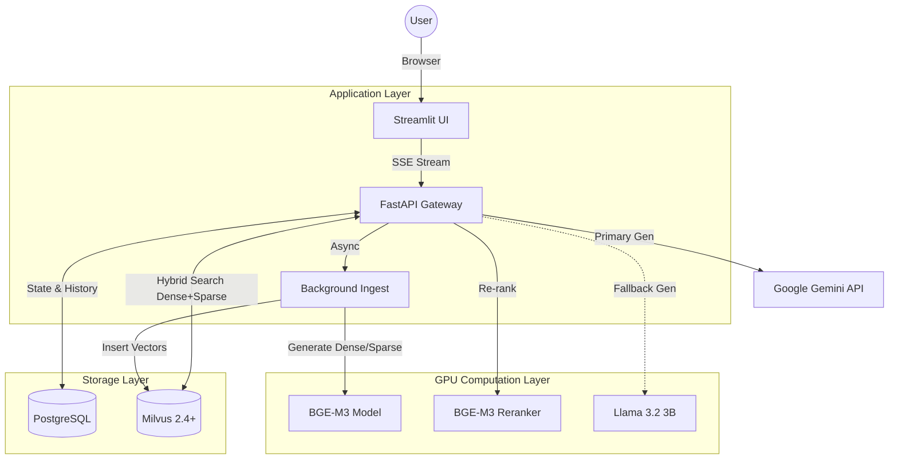
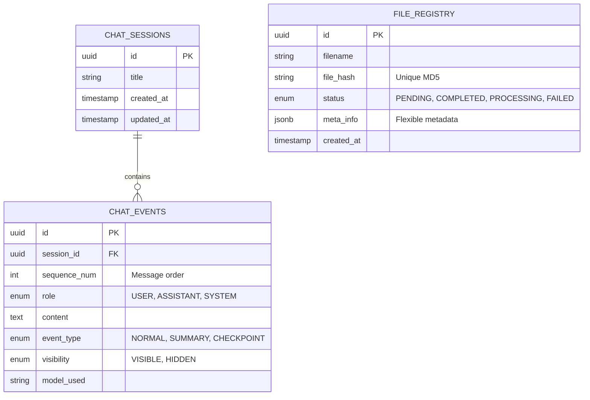
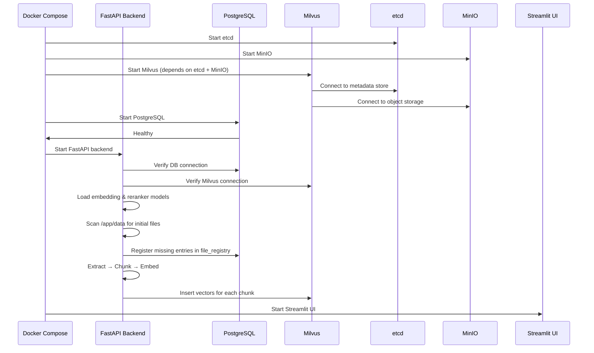
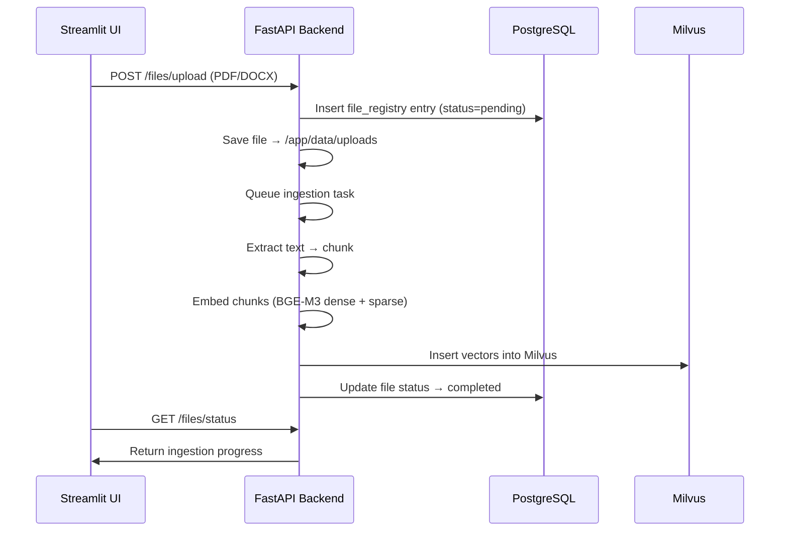
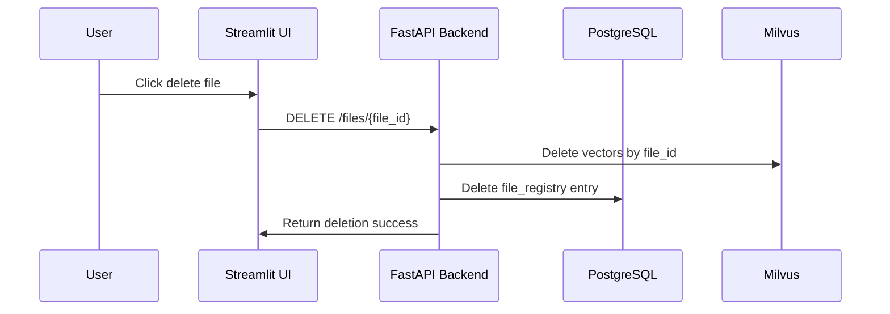
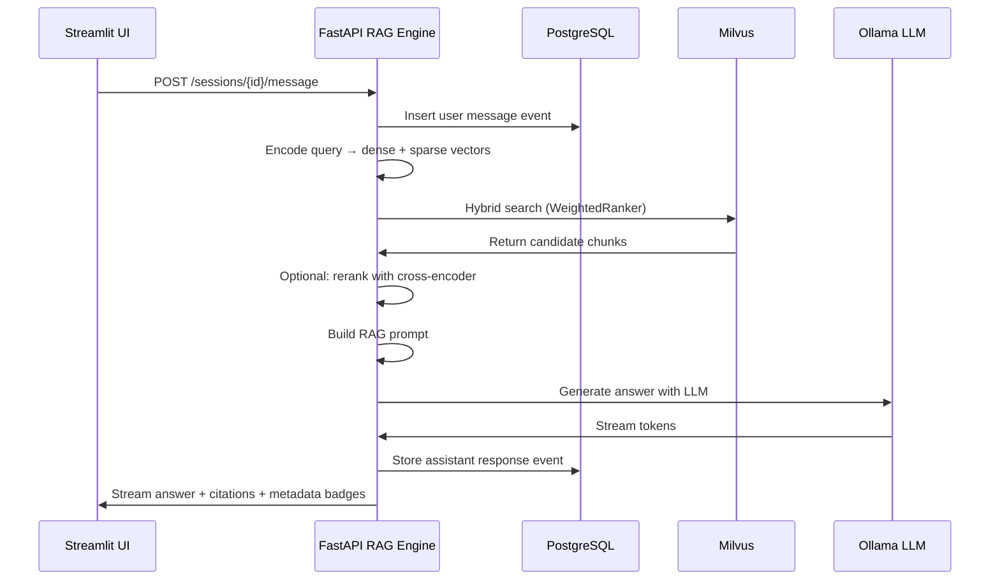
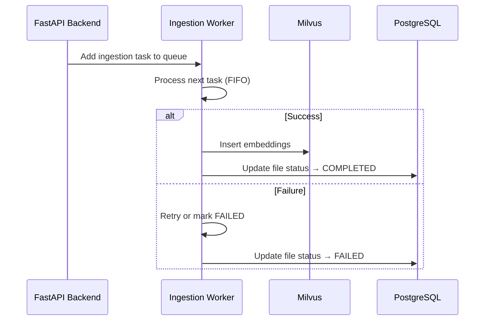
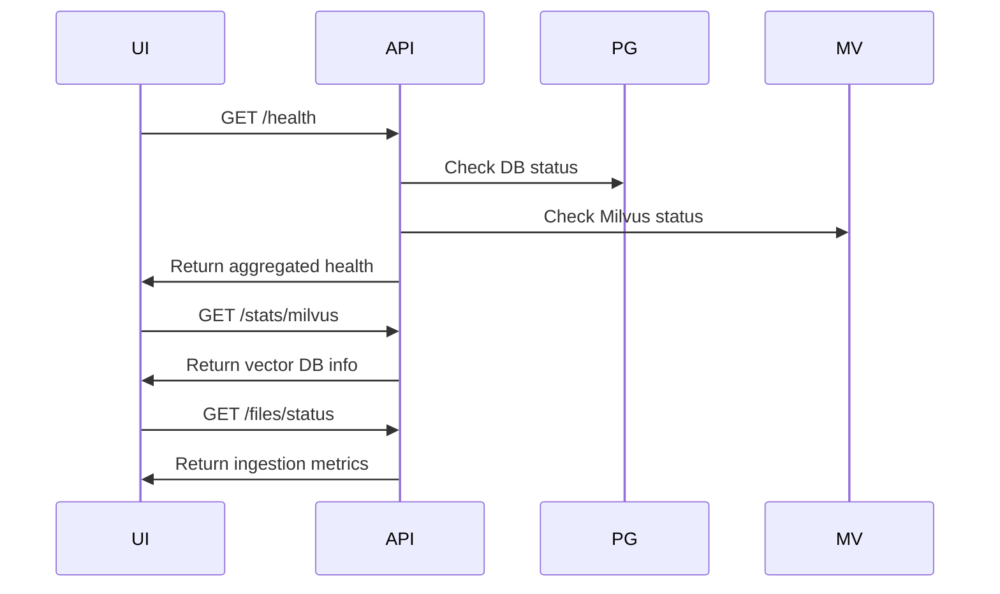

# 📘 DESIGN SPECIFICATION: RAG 

**Model:** Microservices / Hybrid Search / GPU-Accelerated

---

## 1. SYSTEM OVERVIEW

### 1.1. Objectives

Build an **AI Financial Assistant** capable of:

1. **Deep Document Understanding:** Accurately search and retrieve information from thousands of pages (PDF/Doc).
2. **Factually Accurate Responses:** Every answer cites its source clearly.
3. **Long-Term Memory:** Maintain conversation context indefinitely without being constrained by context window.
4. **High Speed:** Responses under 3 seconds with GPU acceleration.

### 1.2. High-Level Architecture


---

### 1.3. Project Structure

```bash
rag/
├── api/
│   ├── app/
│   │   ├── database.py       # PostgreSQL connection & ORM models
│   │   ├── ingest.py         # File ingestion, chunking, embedding to Milvus
│   │   ├── rag.py            # RAG query & retrieval logic
│   │   ├── main.py           # FastAPI app entry point
│   │   └── __init__.py
│   ├── data/                 # Preloaded files for initial knowledge base
│   ├── Dockerfile
│   └── requirements.txt
├── ui/
│   ├── app.py                 # Streamlit frontend
│   ├── Dockerfile
│   └── requirements.txt
├── docker-compose.yml         # Orchestrates API, UI, DB, Milvus, MinIO, etc.
├── Makefile                   # Utility scripts for build/start/stop
├── .env.example               # Environment variable template
├── .gitignore
└── README.md
```

---

### **Directory Purpose & Workflow**

* **api/**: FastAPI backend, ingestion logic, and RAG engine.

* **api/data/**: Stores preloaded files that form the **initial knowledge base**. On system startup:

  1. FastAPI scans all files in `api/data/`.
  2. Checks if the file already exists in `file_registry` (via hash).
  3. If not process yet or process not success, inserts metadata into PostgreSQL (`status=PENDING`) and triggers ingestion.
  4. Chunks file → generates dense + sparse embeddings → inserts into Milvus.
  5. Updates status to `COMPLETED`.

* **ui/**: Streamlit frontend for chat, file management, and system monitoring.

* **docker-compose.yml**: Orchestrates all services including API, UI, PostgreSQL, Milvus, MinIO, and etcd.

* **Makefile & .env**: Utility scripts and environment configuration.

---
### 1.4. AI Model Strategy 

To handle **high embedding load but low fallback LLM usage**, stack allocation per GPU (e.g., 16GB VRAM) is as follows:

| Component    | Model                    | VRAM    | Role & Reason                                                                                                                               |
| ------------ | ------------------------ | ------- | ------------------------------------------------------------------------------------------------------------------------------------------- |
| Embedding    | BAAI/bge-m3              | ~1.5 GB | Core of the system. Generates both:<br>1. **Dense Vector** – Semantic search.<br>2. **Sparse Vector** – Keyword search (replaces BM25/FTS). |
| Primary LLM  | Gemini 2.0 Flash         | API     | High speed, large context.                                                                                                                  |
| Reranker     | BAAAI/bge-reranker-v2-m3 | ~1.5 GB | Fully compatible with BGE-M3 embeddings.                                                                                                    |
| Fallback LLM | Llama 3.2:3b             | ~2.5 GB | Offline backup (Ollama).                                                                                                                    |

**Enhancements:**

* Add **embedding versioning** to track which embeddings were generated with which model/version.
* Use **chunk hashes** to prevent duplicate embeddings even if the file content is modified slightly.
---

## 2. DATABASE DESIGN

We adopt a **Hybrid Storage** model: relational (Postgres) + vector (Milvus).

### 2.1. PostgreSQL Schema (`rag_db`)

Responsible for **data integrity** and **file/conversation management**.

**Database:** PostgreSQL 15+

**Purpose:** Manage Knowledge Base and Smart Conversation Context.

---

### A. Entity-Relationship Diagram (ERD)

Two main clusters: **Document Management (Ingestion)** and **Conversation Management**.



---

### B. Table Details

#### Cluster 1: Conversation Management

**`chat_sessions`** – Stores overarching session info.

| Column       | Type           | Constraint                       | Description                                |
| ------------ | -------------- | -------------------------------- | ------------------------------------------ |
| **`id`**     | `UUID`         | PK, default `uuid_generate_v4()` | Unique session identifier.                 |
| `title`      | `VARCHAR(255)` | Default `New Chat`               | Auto trigger whenever updating new `SUMMARY` or `CHECKPOINT` |
| `created_at` | `TIMESTAMPTZ`  | Default `NOW()`                  | Session start time.                        |
| `updated_at` | `TIMESTAMPTZ`  | Default `NOW()`                  | Last message time (for sorting sidebar).   |

---

**`chat_events`** – Core memory table for AI context.

| Column           | Type          | Constraint                                   | Description & Business Logic                                                                                                                                             |
| ---------------- | ------------- | -------------------------------------------- | ------------------------------------------------------------------------------------------------------------------------------------------------------------------------ |
| **`id`**         | `UUID`        | PK                                           | Unique event ID.                                                                                                                                                         |
| `session_id`     | `UUID`        | FK → `chat_sessions.id`, `ON DELETE CASCADE` | Ensures all events are deleted if session deleted.                                                                                                                       |
| `sequence_num`   | `INTEGER`     | NOT NULL                                     | Absolute message order (independent of timestamp).                                                                                                                       |
| `role`           | `ENUM`        | USER, ASSISTANT, SYSTEM                      | Originator of the message.                                                                                                                                               |
| `content`        | `TEXT`        | NOT NULL                                     | Message or summary content.                                                                                                                                              |
| **`event_type`** | `ENUM`        | NORMAL, SUMMARY, CHECKPOINT                  | Implements **3-3 Memory:**<br>- `NORMAL`: Regular message.<br>- `SUMMARY`: Short summary after 3 message pairs.<br>- `CHECKPOINT`: Aggregated summary after 3 summaries. |
| **`visibility`** | `ENUM`        | VISIBLE, HIDDEN                              | Controls UI display vs AI-only context.                                                                                                                                  |
| `model_used`     | `VARCHAR(50)` | Nullable                                     | Tracks model used for response (e.g., `gemini-2.0-flash`).                                                                                                                     |

**Index Strategy:**

* `idx_session_sequence (session_id, sequence_num)` → Fast sequential chat retrieval.

---

#### Cluster 2: Knowledge Base & Document Management

**`file_registry`** – Keeps record of uploaded files.

| Column       | Type           | Constraint                             | Description                                             |
| ------------ | -------------- | -------------------------------------- | ------------------------------------------------------- |
| **`id`**     | `UUID`         | PK                                     | File identifier.                                        |
| `file_hash`  | `VARCHAR(32)`  | UNIQUE                                 | MD5 hash for deduplication.                             |
| `filename`   | `VARCHAR(255)` | NOT NULL                               | Original filename.                                      |
| `status`     | `ENUM`         | PENDING, PROCESSING, COMPLETED, FAILED | Processing state for UI display.                        |
| `meta_info`  | `JSONB`        | Default `{}`                           | Flexible metadata: `{ "pages": 150, "author": "CEO" }`. |
| `created_at` | `TIMESTAMPTZ`  | Default `NOW()`                        | Creation time.                                          |

**Index Strategy:**

* `idx_file_meta_gin` → GIN index for fast JSONB metadata queries.

**Enhancements:**

* Consider adding **importance score** per chunk to prioritize retrieval.
* Keep **ingestion timestamp** per chunk in Milvus for incremental updates.

---

### C. Why This Design is Optimal

1. **Data Integrity:**

   * Foreign keys with cascade delete avoid orphan data.
   * Enums prevent typos in message roles and event types.

2. **High Performance:**

   * Hybrid search fully on Milvus (dense + sparse).
   * JSONB allows future metadata expansion without schema changes.

3. **Smart Memory Architecture:**

   * `chat_events` table with `event_type` + `visibility` enables **Infinite Context** efficiently.
   * Reduces token cost by sending summaries/checkpoints instead of all raw messages.

4. **Analytics-Ready:**

   * Clean separation of tables allows easy sync to ClickHouse for advanced analytics.

---

### D. SQL Script (Quick Setup)

```sql
-- Enable UUID extension
CREATE EXTENSION IF NOT EXISTS "uuid-ossp";

-- Define Enums
CREATE TYPE filestatus AS ENUM ('PENDING','PROCESSING','COMPLETED','FAILED');
CREATE TYPE messagerole AS ENUM ('USER','ASSISTANT','SYSTEM');
CREATE TYPE eventtype AS ENUM ('NORMAL','SUMMARY','CHECKPOINT');
CREATE TYPE visibility AS ENUM ('VISIBLE','HIDDEN');

-- File Registry
CREATE TABLE file_registry (
    id UUID PRIMARY KEY DEFAULT uuid_generate_v4(),
    file_hash VARCHAR(32) NOT NULL UNIQUE,
    filename VARCHAR(255) NOT NULL,
    status filestatus DEFAULT 'PENDING',
    meta_info JSONB DEFAULT '{}',
    created_at TIMESTAMPTZ DEFAULT NOW()
);

-- Chat Sessions
CREATE TABLE chat_sessions (
    id UUID PRIMARY KEY DEFAULT uuid_generate_v4(),
    title VARCHAR(255),
    created_at TIMESTAMPTZ DEFAULT NOW(),
    updated_at TIMESTAMPTZ DEFAULT NOW()
);

-- Chat Events
CREATE TABLE chat_events (
    id UUID PRIMARY KEY DEFAULT uuid_generate_v4(),
    session_id UUID REFERENCES chat_sessions(id) ON DELETE CASCADE,
    sequence_num INT NOT NULL,
    role messagerole NOT NULL,
    content TEXT NOT NULL,
    event_type eventtype DEFAULT 'NORMAL',
    visibility visibility DEFAULT 'VISIBLE',
    model_used VARCHAR(50),
    UNIQUE(session_id, sequence_num)
);
```

---

### 2.2. Milvus Schema (`rag_hybrid_collection`)

| Field            | Type              | Dimension / Max | Index                 | Description                                 |
| ---------------- | ----------------- | --------------- | --------------------- | ------------------------------------------- |
| id               | Int64             | AutoID          | -                     | Primary key.                                |
| dense_vector     | FloatVector       | 1024            | HNSW                  | Semantic search (cosine).                   |
| sparse_vector    | SparseFloatVector | -               | SPARSE_INVERTED_INDEX | Keyword search (inner product).             |
| content          | VarChar           | 65535           | -                     | Original chunk text.                        |
| file_id          | VarChar           | 36              | Scalar Index          | Foreign key to `file_registry.id`.          |
| page_number      | Int32             | -               | -                     | Page number metadata.                       |
| importance_score | Float             | -               | -                     | Optional score to boost retrieval priority. |

**Enhancements:**

* Track **chunk version** and **hash** to allow incremental updates.
* Store **embedding timestamp** to handle model upgrades.

---

## 3. CORE ALGORITHMS

The RAG system relies on **efficient retrieval and relevance ranking** to provide accurate answers. The design leverages BGE-M3 embeddings with Milvus vector DB and an optional cross-encoder reranker.

---

### 3.1. Ingestion Workflow (Using BGE-M3)

1. **Chunking:** Split each document into chunks of 512–1024 tokens.
2. **Embedding (BGE-M3):**

   * Generate both dense and sparse embeddings in a **single model call**.
   * Output:

     ```python
     {'dense': [...], 'sparse': {index: weight, ...}}
     ```
   * Dense vectors capture semantic meaning; sparse vectors capture keyword-weight information.
3. **Insert into Milvus:**

   * Combine: `dense_vector + sparse_vector + content + file_id`.
   * Insert into the Milvus collection for later hybrid search.

**Algorithm Description:**

* Dense embeddings allow semantic search, understanding the meaning of the text beyond keywords.
* Sparse embeddings are closer to TF-IDF style keyword matching but with learned weights, improving precision for domain-specific queries (e.g., finance).
* Milvus stores both types of vectors, enabling hybrid search that combines semantic and keyword relevance.

---

### 3.2. Milvus Native Hybrid Search Algorithm 

This search approach **delegates most of the search logic to Milvus**. It retrieves candidate chunks using a combination of dense and sparse vectors, boosts them with `importance_score`, and optionally reranks them using a cross-encoder.

**Step-by-step Explanation:**

1. **Encode Query:** Use BGE-M3 to obtain both dense and sparse representations.
2. **Separate ANN Requests:**

   * **Dense Request:** cosine similarity search over dense vectors.
   * **Sparse Request:** inner product search over sparse vectors.
3. **Hybrid Search Fusion with Importance Score:**

   * Milvus combines the results using a `WeightedRanker` (e.g., 0.7 dense + 0.3 sparse).
   * `importance_score` is added to boost critical chunks in initial ranking.
4. **Candidate Deduplication:** Remove repeated chunks by ID.
5. **Optional Cross-Encoder Reranking:**

   * Pairs the query with candidate chunks and produces fine-grained relevance scores.
   * `importance_score` is combined with rerank scores to prioritize high-importance content.
6. **Return Top-K Chunks:** Only return the final `top_k` high-quality chunks for prompting the LLM.

**Python Implementation:**

```python
from pymilvus import Collection, AnnSearchRequest, WeightedRanker
from typing import List, Dict, Any
import torch
import numpy as np

# Assume these two models are already loaded on GPU
bge_m3_embedder = None      # BAAI/bge-m3 (dense + sparse)
bge_reranker = None         # BAAI/bge-reranker-v2-m3  (cross-encoder)

# Milvus Collection
collection = Collection("rag_hybrid_collection")
collection.load()

async def hybrid_search_with_importance(
    query_text: str,
    filter_expr: str = None,           # e.g., "year == 2024 && company == 'HPG'"
    top_k_dense: int = 20,
    top_k_sparse: int = 20,
    final_top_k: int = 7,              # number of chunks to include in the prompt
    alpha: float = 0.2,                # importance boost weight for hybrid score
    beta: float = 0.8,                 # cross-encoder weight
    gamma: float = 0.2                 # importance weight in final rerank
) -> List[Dict[str, Any]]:

    # ----------------------------
    # Step 1: Encode query
    # ----------------------------
    query_emb = bge_m3_embedder.encode(
        queries=[query_text],
        return_dense=True,
        return_sparse=True,
        return_colbert_vecs=False
    )[0]

    dense_vec = query_emb['dense'].tolist()
    sparse_vec = query_emb['sparse']

    # ----------------------------
    # Step 2: Create ANN requests
    # ----------------------------
    dense_request = AnnSearchRequest(
        data=[dense_vec],
        anns_field="dense_vector",
        param={"metric_type": "COSINE", "params": {"efSearch": 128}},
        limit=top_k_dense
    )
    sparse_request = AnnSearchRequest(
        data=[sparse_vec],
        anns_field="sparse_vector",
        param={"metric_type": "IP", "params": {"drop_ratio_search": 0.1}},
        limit=top_k_sparse
    )

    # ----------------------------
    # Step 3: Hybrid search (Milvus fusion + importance boost)
    # ----------------------------
    raw_results = collection.hybrid_search(
        reqs=[dense_request, sparse_request],
        rerank=WeightedRanker(0.7, 0.3),  # dense + sparse fusion
        limit=top_k_dense + top_k_sparse,
        output_fields=["content", "file_id", "page_number", "company", "year", "importance_score"],
        expr=filter_expr
    )[0]

    # ----------------------------
    # Step 4: Aggregate hits & apply importance_score boost
    # ----------------------------
    candidate_chunks = []
    seen_ids = set()
    for hit in raw_results:
        if hit.id in seen_ids:
            continue
        seen_ids.add(hit.id)

        imp_score = hit.entity.get("importance_score", 0.0)
        # Combine hybrid distance and importance
        combined_score = hit.distance * 0.7 + hit.distance * 0.3 + alpha * imp_score

        candidate_chunks.append({
            "id": hit.id,
            "content": hit.entity.get("content"),
            "file_id": hit.entity.get("file_id"),
            "page_number": hit.entity.get("page_number"),
            "company": hit.entity.get("company"),
            "year": hit.entity.get("year"),
            "distance": hit.distance,
            "importance_score": imp_score,
            "combined_score": combined_score
        })

    # Early return if few candidates
    if len(candidate_chunks) <= final_top_k:
        return candidate_chunks

    # ----------------------------
    # Step 5: Optional cross-encoder rerank
    # ----------------------------
    top_rerank_candidates = candidate_chunks[:50]  # limit GPU usage
    query_chunk_pairs = [(query_text, chunk["content"]) for chunk in top_rerank_candidates]

    with torch.no_grad():
        inputs = bge_reranker.encode(
            query_chunk_pairs,
            batch_size=16,
            max_length=512,
            return_tensors="pt"
        ).to("cuda")
        rerank_scores = bge_reranker(**inputs, normalize=True).logits.squeeze(1).cpu().numpy()

    # ----------------------------
    # Step 6: Combine rerank_score with importance_score
    # ----------------------------
    for chunk, score in zip(top_rerank_candidates, rerank_scores):
        chunk["final_score"] = beta * score + gamma * chunk["importance_score"]

    # ----------------------------
    # Step 7: Return top final_top_k chunks
    # ----------------------------
    final_chunks = sorted(top_rerank_candidates, key=lambda x: x["final_score"], reverse=True)[:final_top_k]

    return final_chunks
```
---

**Advantages of this version:**

* Fully integrates `importance_score` into both **initial hybrid search** and **cross-encoder reranking**.
* GPU-efficient: reranks only top N candidates.
* Parameterizable weights (`alpha`, `beta`, `gamma`) for tuning importance impact.
* Deduplication ensures unique chunks for LLM prompts.

---

### 3.3. 3-3 Memory Mechanism (Infinite Context)

To handle long chats without losing context:

* Every **3 chat turns (6 messages):** generate a small summary.
* Every **3 summaries:** merge into the master **checkpoint** (The master checkpoint after update can append to the table in database for easy operating instad of updating its old row).
* Prompt sent to LLM: `[Checkpoint] + [Remaining Summaries] + [Recent Messages]`.

**Benefit:** AI retains the **full historical context** without consuming excessive tokens.

---

## 4. UI/UX DESIGN (Streamlit)

The UI is designed for **clarity, minimalism, and technical transparency**. It serves as the user’s window to the AI, providing access to **chat, file management, and system monitoring**.

* **System Health & Dashboard:** Monitor service status in real time.
* **Chat Interface:** Interact with the AI using **knowledge base, SQL, or hybrid sources**, complete with metadata badges.
* **File Manager:** Upload, track, and manage documents in the ingestion pipeline.

The UI communicates with the backend via **RESTful FastAPI endpoints**, using polling and streaming to ensure a responsive experience.

---

### 4.1. Backend Endpoints (FastAPI Gateway)

#### A. **LIFECYCLE**

| # | HTTP Method / Event | Endpoint / Trigger | Description                                                                                                           |
| - | ------------------- | ------------------ | --------------------------------------------------------------------------------------------------------------------- |
| 1 | @app.on_event       | `"startup"`        | Initializes DB, loads models, creates directories, starts ingestion workers, and auto-ingests files from `api/data/`. |
| 2 | @app.on_event       | `"shutdown"`       | Cleans up resources, closes DB/vector connections, and gracefully stops workers.                                      |

---

#### B. **SYSTEM & HEALTH**

| # | HTTP Method | Endpoint          | Description                                                              |
| - | ----------- | ----------------- | ------------------------------------------------------------------------ |
| 3 | GET         | /health           | Returns overall system health (DB, Milvus, Model Engine).                |
| 4 | GET         | /health/db        | Verifies PostgreSQL connectivity and version.                            |
| 5 | GET         | /health/vector-db | Verifies Milvus connectivity and collection statistics.                  |
| 6 | GET         | /stats/milvus     | Returns detailed Milvus stats (index state, row count, segments).        |
| 7 | GET         | /stats/system     | Aggregated system stats (total files, processed chunks, message count).  |
| 8 | GET         | /system/services  | Lists status & URLs of linked services (UI, MinIO, Attu, etc.).          |
| 9 | GET         | /features         | Lists enabled system features (Hybrid Search, Rerank, Chunking options). |

---

#### C. **CHAT SESSIONS**

| #  | HTTP Method | Endpoint                       | Description                                                                    |
| -- | ----------- | ------------------------------ | ------------------------------------------------------------------------------ |
| 10 | POST        | /chat                          | Main RAG endpoint (streaming). Handles query → retrieve → rerank → generate.   |
| 11 | GET         | /sessions                      | Lists all chat sessions with metadata.                                         |
| 12 | POST        | /sessions                      | Creates a new chat session.                                                    |
| 13 | GET         | /sessions/{session_id}         | Retrieves metadata for a specific session.                                     |
| 14 | DELETE      | /sessions/{session_id}         | Deletes a session and all messages.                                            |
| 15 | GET         | /sessions/{session_id}/history | Retrieves visible user + assistant messages.                                   |
| 16 | GET         | /sessions/{session_id}/events  | Retrieves raw event logs (includes system summaries, memory, hidden messages). |
| 17 | POST        | /sessions/{session_id}/message | Sends a user message and returns a **non-streaming** response.                 |

---

#### D. **FILE MANAGEMENT (Document Ingestion Pipeline)**

| #  | HTTP Method | Endpoint         | Description                                                                  |
| -- | ----------- | ---------------- | ---------------------------------------------------------------------------- |
| 18 | POST        | /files/upload    | Uploads a PDF/Doc for background ingestion. *(Primary endpoint)*             |
| 19 | GET         | /files           | Returns all uploaded files with detailed ingestion metadata.                 |
| 20 | GET         | /files/status    | Returns lightweight aggregated counts (pending/processing/completed/failed). |
| 21 | GET         | /files/{file_id} | Returns full detail, chunk stats, and error logs for a file.                 |
| 22 | DELETE      | /files/{file_id} | Deletes a file and all its associated vectors in Milvus.                     |


---

### **4.2. Service URLs (Docker Compose Runtime)**

This table reflects **every service** defined in the Docker Compose stack. It provides the accessible URLs, exposed ports, and functional roles within the RAG system.

---

#### **Service Overview Table**

| Component                     | URL / Host:Port                                                | Purpose                                          | Notes                                              |
| ----------------------------- | -------------------------------------------------------------- | ------------------------------------------------ | -------------------------------------------------- |
| **UI (Streamlit)**            | [http://localhost:8501](http://localhost:8501)                 | Frontend application                             | Communicates with API via internal DNS `api:8000`. |
| **Backend API (FastAPI)**     | [http://localhost:8000](http://localhost:8000)                 | RAG engine, embeddings, reranking, hybrid search | Runs GPU-accelerated BGE-M3 + reranker.            |
| **Ollama (Local LLM Server)** | [http://localhost:11435](http://localhost:11435)               | Chat model provider (Llama 3.2 3B)               | Embeddings NOT from Ollama; only chat.             |
| **PostgreSQL**                | localhost:5433                                                 | Metadata DB, chat history, file registry         | Accessible from host for debugging with pgAdmin.   |
| **Milvus (Standalone)**       | milvus:19530 → mapped to localhost:19530                       | Vector store for hybrid search                   | Stores dense+lexical embeddings.                   |
| **Milvus Health Monitor**     | [http://localhost:9091/healthz](http://localhost:9091/healthz) | Milvus health endpoint                           | Used by Docker healthcheck.                        |
| **etcd**                      | etcd:2379 (internal only)                                      | Milvus metadata store                            | Not exposed to host—internal service only.         |
| **MinIO Console**             | [http://localhost:9001](http://localhost:9001)                 | Web UI for Milvus segment storage                | Useful to inspect raw segment files.               |
| **MinIO API**                 | [http://localhost:9003](http://localhost:9003)                 | S3-compatible storage backend                    | Milvus stores vector segments here.                |
| **Attu (Milvus UI)**          | [http://localhost:3000](http://localhost:3000)                 | Milvus cluster inspection & vector debugging     | Recommended for evaluating vectors/chunks.         |
| **HF Cache Volume**           | N/A (volume)                                                   | Stores downloaded BGE-M3 models                  | Improves cold-start speed.                         |
| **Ollama Data Volume**        | N/A (volume)                                                   | Stores downloaded/pulled Ollama models           | Ensures persistence across restarts.               |

---

#### 🔍 Notes and Validations

#### ✔ **Accurate Port Mapping**

All host-facing ports exactly match the Docker Compose definitions:

* UI → 8501
* API → 8000
* Ollama → 11435 (host) → 11434 (container)
* PostgreSQL → 5433
* Milvus → 19530 + 9091
* MinIO → 9001 (console), 9003 (API)
* Attu → 3000

#### ✔ **Matches RAG System Roles**

Every component appears with a clearly defined purpose:

* **UI** as UX layer
* **API** as orchestrator + RAG engine
* **Ollama** as chat LLM
* **Milvus** as vector DB
* **PostgreSQL** as metadata/history DB
* **MinIO + etcd** backing Milvus
* **Attu** for observability

#### ✔ **All internal-only services noted**
`etcd` is correctly marked non-public (internal only).

---

### 4.3. File Manager (Aligned to FastAPI Endpoints)

* **List files:** `GET /files` → Returns all uploaded files along with status, page count, and chunk/embedding info.
* **Upload documents:** `POST /files/upload` → Upload PDF or Doc for background ingestion and automatic embedding.
* **Alias upload:** `POST /upload` → Shortcut endpoint for document upload (calls `/files/upload` internally).
* **Delete files:** `DELETE /files/{file_id}` → Removes file from `file_registry` and deletes associated vectors from Milvus.
* **Processing status:** `GET /files/status` → Returns a summary of file ingestion progress (pending, processing, completed, failed).
* **File details & errors:** `GET /files/{file_id}` → Returns detailed metadata and any ingestion or embedding errors for a specific file.

**Notes:**

* The UI should poll `/files/status` to update live progress bars.
* For each file, metadata badges can display: page count, author (from `meta_info`), chunks, and embedding completion status.

---

### 4.4. Workflow Summary 

#### **4.4.1. Startup Process (Automatic Ingestion of Initial Files)**

**Description:**
When the API service starts, it performs several initialization tasks:

1. Ensures PostgreSQL & Milvus are reachable.
2. Loads embedding and reranker models (BGE-M3, BGE-reranker-v2-m3).
3. Scans `api/data/` for static preloaded documents.
4. For each file not yet registered:

   * Insert into `file_registry`
   * Extract + chunk
   * Embed (dense + sparse)
   * Insert vectors into Milvus
   * Track embedding version, timestamp, file metadata

This creates a **ready-to-use knowledge base on first boot**.



**Key Points:**

* Ensures a **pre-built knowledge base** on startup.
* Embedding versioning enables **safe future re-embedding** (model upgrades).
* Initial ingestion uses the same pipeline as user uploads → consistent indexing.

---

#### **4.4.2. User File Upload Workflow**

**Description:**
Users may upload documents (PDF, DOCX, etc.) via:

``` bash
POST /files/upload
```

The system:

1. Stores the file in `/app/data/uploads/`.
2. Creates a `file_registry` entry (`status='pending'`).
3. Adds a task to the **background worker queue**.
4. Worker extracts → chunks → embeds → inserts into Milvus.
5. Updates file status (`completed` or `failed`).



**Key Points:**

* Ingestion runs **asynchronously** to keep API responsive.
* Each chunk stores `importance_score` → used later to bias hybrid ranking.
* UI polls `/files/status` for real-time progress.

---

#### **4.4.3. File Deletion Workflow**

**Description:**
When a file is deleted:

1. All embedded vectors in Milvus with the file’s ID are removed.
2. Corresponding DB entries are removed from `file_registry` and related tables.
3. UI is notified for refresh.



**Key Points:**

* Prevents **orphaned vectors** in Milvus.
* Ensures total consistency between DB and vector store.

---

#### **4.4.4. Chat Process (Hybrid Search → Rerank → LLM Answer)**

**Description:**
The main query pipeline:

1. User message stored in DB as an event.
2. BGE-M3 produces **dense + sparse vectors**.
3. Milvus hybrid search returns candidates.
4. Optional **cross-encoder reranker** (BGE Reranker).
5. Top chunks injected into RAG prompt.
6. LLM (Ollama or Gemini) generates the final answer.
7. Response saved in DB and streamed to the UI.



**Key Points:**

* `importance_score` can weight candidate scoring.
* Hybrid search = 0.7 dense + 0.3 sparse by default.
* 3-3 memory (3 messages + 3 summaries) optimizes context window.

---

#### **4.4.5. Background Worker & Task Queue**

**Description:**
The background worker is responsible for all ingestion tasks:

* Startup indexing
* User-uploaded files
* Re-embedding tasks
* Retry logic for failures
* Logging



**Key Points:**

* Decouples ingestion from the request cycle.
* Enables **horizontal scaling** (multiple workers).
* Ensures reliability with exponential backoff & failure tracking.

---

#### **4.4.6. System Health & Monitoring**

**Description:**
The UI continuously polls the backend:

* `/health` → overall system readiness
* `/health/vector-db` → Milvus status
* `/health/db` → PostgreSQL status
* `/stats/milvus` → index & row count
* `/files/status` → ingestion pipeline status



**Key Points:**

* Real-time visibility into ingestion, DB, vector DB, GPU usage.
* Prevents “silent failures” during indexing or model loading.

---
Below is a refined version of your **Section 5** focusing on **5.1 (Docker/Compose Strategy)**, **5.4 (Prompting Strategy & LLM Guidance)**, and **5.5 (Monitoring, Logging & Maintenance)** — written in a design‑doc style suitable for inclusion in a project spec.

---

## 5. INFRASTRUCTURE & DEPLOYMENT 

### 5.1. Docker / `docker-compose` Strategy

* Use a **single `docker-compose.yml` (or set of compose YAMLs with optional profiles)** to orchestrate all services of the RAG system: embedding & reranker service, vector database (Milvus), relational database (PostgreSQL), LLM serving (e.g. local LLM server), ingestion worker, and frontend UI.
* Leverage **GPU passthrough / acceleration** via `nvidia-container-toolkit` / Docker GPU support in services that require GPU (embedding generation, reranking, LLM inference). In compose file define those services with GPU resource reservations (e.g. via `runtime: nvidia` or `deploy.resources.reservations.devices`) so that GPU allocation is explicit and avoids conflicts.
* Use **named volumes (not bind‑mounts for host‑specific data)** for all persistent data: database storage, embedding/vector data, uploaded documents, model caches. This ensures data persists across container restarts and reduces coupling to host directory structure. 
* Define **healthchecks** for critical services (DB, vector DB, LLM server, ingestion) so compose can wait until a service is fully ready before allowing dependent services to start. Use `depends_on` with `condition: service_healthy` where appropriate. This ensures proper startup order and avoids race conditions. 
* Avoid using floating tags like `latest`; instead, **pin Docker images to specific version tags** so deployments are reproducible and avoid unexpected behavior when base images update. 
* Use **environment variables and `.env` file(s)** for configuration parameters (GPU device IDs, memory/cpu limits, model version, file paths, etc.) rather than hard‑coding values. This improves portability across environments (dev / staging / prod).
* (Optional but recommended) Define **service profiles** in compose to enable selective startup of subsets of services (e.g. ingestion-only mode, inference-only mode, full stack), which is useful for resource-limited hosts or different deployment scenarios. 

> **Rationale:** This compose-based orchestration provides a consistent, reproducible environment. Using volumes ensures data durability. healthchecks + GPU resource reservation + pinned versions make the deployment safer and more maintainable.

---

### 5.2. Prompting Strategy & LLM Guidance (Expert‑Style Answers)

To ensure that the LLM responds with high-quality, reliable, and auditable answers (especially critical in financial / document-based domains), embed a structured prompting strategy and guidance as part of the system design:

1. **Standardized RAG Prompt Template**

   * Each time the backend constructs a prompt (to feed into the LLM), wrap retrieved chunks plus memory context in a fixed template. For example:

     ```
     You are an expert financial assistant. Use only the information provided below. Do not hallucinate or invent data.

     === CONTEXT ===
     Conversation history / memory summary:
     <checkpoint + recent summaries + visible recent messages>

     === DOCUMENTS ===
     For each chunk:
       - Source: <filename>, page <page_number>
       - Content: <chunk_text>

     === USER QUESTION ===
     <user's query>

     === INSTRUCTIONS ===
     1. Provide a concise, accurate answer.
     2. Whenever you state a fact, reference the source (filename & page).
     3. If the documents do not contain sufficient information, say: "I don’t have enough information to answer that accurately."
     4. Do not guess or hallucinate. Do not use external knowledge unless you explicitly indicate so.
     ```

   * This template ensures that answers are **grounded in retrieved evidence**, and makes citations explicit — improving factual reliability and auditability.

2. **Answer Style Guide**

   * Guide the LLM to produce **professional, formal, concise, and structured** answers (e.g., bullet lists, sections, summary + detail).
   * Encourage **uncertainty awareness**: if confidence is low or evidence is insufficient, the assistant should flag that rather than produce misleading output.
   * Enforce **citation discipline**: each claim or fact must have a corresponding reference. This helps especially in financial contexts where traceability is crucial.

3. **Prompt / Template Versioning & Central Repository**

   * Store prompt templates (and their metadata: version, purpose, performance metrics) in a **central prompt repository** (e.g. a directory under version control). This supports collaboration, reuse across different flows, experimentation, and tracking of prompt quality over time. This approach echoes patterns recommended in prompt engineering research. 
   * Maintain change history so that modifications to prompts (e.g., updated instructions, added guardrails) are tracked for reproducibility and auditing.

4. **Fallback & Fail‑Safe Behavior**

   * If retrieved context yields insufficient relevant chunks (e.g. low similarity scores, missing key info), instruct the LLM to respond with a **safe fallback** such as “I don’t have enough information” rather than produce speculative answers.
   * Optionally: mark such responses for **human review or user confirmation**, especially for high-stakes domains like finance or compliance.

> **Rationale:** This prompting discipline helps reduce hallucinations, improves answer trustworthiness, and aligns output style with the expectations of an expert assistant. It transforms the LLM from “free-form generator” into a **grounded, citation-aware reasoning engine** suitable for professional contexts.

---

### 5.3. Monitoring, Logging & Maintenance Strategy

To ensure long-term reliability, observability, and maintainability of the RAG system, embed monitoring, logging, and maintenance practices from the start:

* **Health & Service Monitoring**

  * Expose health endpoints (e.g. `/health`, `/health/db`, `/health/vector-db`, `/health/llm`) for all critical services (API, database, vector store, LLM server, ingestion). The orchestrator (docker-compose) relies on healthchecks to verify readiness and perform dependencies or restarts if needed. 
  * Optionally integrate a monitoring stack (e.g. Prometheus + Grafana) to track resource usage (CPU, GPU, RAM, disk I/O), request latency, ingestion queue backlog, vector‑store size/growth, error rates. This is essential especially in production or heavy‑load use.

* **Resource & Volume Management**

  * Ensure persistent volumes for data storage (database, vectors, uploaded files, model caches) are regularly **backed up**. Vector store data and embeddings are expensive to regenerate, so backups (or snapshotting) are critical.
  * Monitor disk usage and perform maintenance tasks periodically (e.g. compaction, cleanup, re-indexing, embedding version upgrades).

* **Logging & Audit Trails**

  * Log all user queries, retrieval results (which document/chunk IDs were retrieved), LLM prompts & responses (including citation metadata), ingestion events, errors, and system events (e.g. container restarts, healthcheck failures).
  * Store these logs in a centralized, durable store (e.g. separate log files, logging DB, or ELK-like system) — essential for debugging, compliance, or postmortem analysis.
  * Consider log-level control (info, warn, error) and retention policies.

* **Version & Configuration Management**

  * Version control **docker-compose files**, `.env` configurations, prompt templates, schema migrations — treat them like code. This ensures reproducibility and easy rollback. 
  * Track embedding / reranker / model versions used to generate vectors in metadata (e.g. embedding version, model commit hash, build date) to support re‑indexing / auditing.

* **Operational Procedures & Maintenance Windows**

  * Define periodic maintenance windows for heavy tasks (e.g. re‑embedding corpus, index rebuilds, compaction).
  * Establish alerting: e.g. if vector store growth exceeds threshold, disk usage > X%, ingestion backlog high, healthcheck failures, etc.
  * Testing & validation: after major changes (e.g. model version, prompt template), run test queries and QA to ensure retrieval + generation quality remains acceptable.

> **Rationale:** Without comprehensive monitoring, logging, and maintenance, even a well-designed RAG system can degrade over time, become unreliable, or produce incorrect responses. Embedding these practices ensures robustness, traceability, and operational maturity.

---
