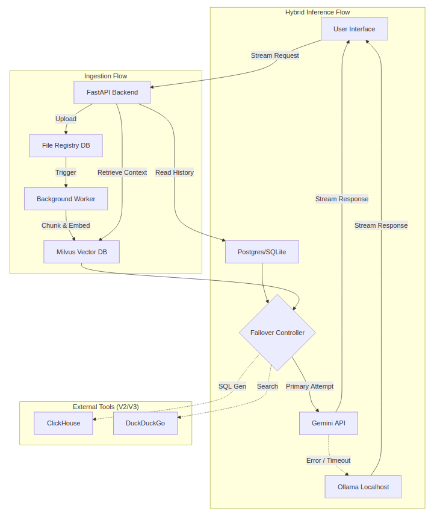

# Hybrid RAG & Analytics System (Gemini + Ollama)

## 📖 Overview
This project builds a resilient, context-aware AI Assistant designed for high availability and data intelligence. It employs a **Hybrid LLM Architecture**:
* **Primary Engine:** **Google Gemini API** for high-performance reasoning and long-context capabilities.
* **Fallback Engine:** **Ollama (Local)** to ensure continuity during network outages or API rate-limiting.

The system evolves through three phases:
1.  **Core RAG:** Document-based Q&A with hierarchical memory and local fallback.
2.  **Data Analyst:** Integration with ClickHouse (OLAP) and Superset (Visualize).
3.  **Autonomous Researcher:** Internet connectivity for real-time insights.

---

## 🚀 Roadmap & Features

### Version 1: Core RAG & Resilience
**Focus:** Robust ingestion, smart memory, and high availability.

* **Hybrid Inference Engine (Resilience):**
    * **Primary:** Routes requests to `Gemini 2.0 Flash`.
    * **Fallback:** Automatically switches to a local `Ollama` model (e.g., GPT OSS, Mistral) if the Gemini API fails (Connection Error/Rate Limit).
* **File Ingestion Pipeline:**
    * **Format Support:** PDF, TXT, MD, DOCX.
    * **State Tracking:** Registry DB tracks `pending`, `processing`, `processed`, `failed` states.
    * **Auto-Resume:** Background workers automatically retry pending files on startup.
    * **Idempotency:** MD5 hash checks prevent duplicate processing.
* **Hierarchical Memory ("The 3-5 Rule"):**
    * **Short-Term:** Summarizes context every **3 turns**.
    * **Long-Term:** Aggregates **5 summaries** into a global "Checkpoint".
    * **Context Assembly:** *System Prompt + Latest Checkpoint + Recent Summaries + Active Turns + Milvus Docs*.

### Version 2: Data Pipeline Integration
**Focus:** Structured data analytics.

* **Text-to-SQL:**
    * Connects LLM to **ClickHouse** using LangChain SQL Toolkit.
    * Enables natural language queries on business data (e.g., *"Total revenue last Q4"*).
* **Visualizations:**
    * Embeds **Apache Superset** dashboards directly into chat based on intent.

### Version 3: Agentic Capabilities
**Focus:** External world knowledge.

* **Internet Search:**
    * **Tools:** DuckDuckGo (Standard) or Tavily (RAG-optimized).
    * **Routing:** Intelligent router decides between Local KB, Database, or Web Search.

---

## 🏗 System Architecture

The architecture features a "Failover Controller" that manages the switch between Cloud and Local inference.

## 🧠 The "3-5 Rule" Memory Algorithm

To handle long conversations efficiently across both Cloud (Gemini) and Local (Ollama) contexts:

    Turn (Short): 1 User Query + 1 System Answer.

    Summary (Mid): Every 3 Turns, a background task (using Gemini Flash or Ollama) generates a summary. Hidden in DB (visibility_type = 'HIDDEN_SUMMARY').

    Checkpoint (Long): Every 5 Summaries, aggregates them into a master summary (visibility_type = 'HIDDEN_CHECKPOINT').

Context Injection Strategy:

    System Prompt + Latest Checkpoint + Summaries since last Checkpoint + Raw Turns since last Summary + Milvus Chunks.

## 🗄 Database Schema

Table: `chat_messages`

| Column Name      | Type      | Description                                           |
|------------------|-----------|-------------------------------------------------------|
| id               | UUID      | Primary Key                                           |
| session_id       | UUID      | Conversation grouping                                 |
| role             | VARCHAR   | user, assistant, system                               |
| content          | TEXT      | Message text                                          |
| visibility_type  | VARCHAR   | VISIBLE, HIDDEN_SUMMARY, HIDDEN_CHECKPOINT            |
| model_used       | VARCHAR   | Tracks which model replied: gemini-2.0-flash or ollama |
| created_at       | TIMESTAMP | Chronological ordering                                 |

Table: `file_registry`

| Column Name | Type    | Description                                     |
|-------------|---------|-------------------------------------------------|
| file_hash   | VARCHAR | MD5 hash for de-duplication                     |
| status      | VARCHAR | pending, processing, processed, failed          |
| path        | VARCHAR | Storage path                                    |

## 🛠 Tech Stack

    Primary LLM: Google Gemini (2.0 Flash)

    Fallback LLM: Ollama (GPT OSS 20B)

    Backend: Python (FastAPI)

    Vector DB: Milvus (Dockerized)

    OLAP DB: ClickHouse

    Orchestration: LangChain / LangGraph

    Search Tool: DuckDuckGo (via duckduckgo-search)