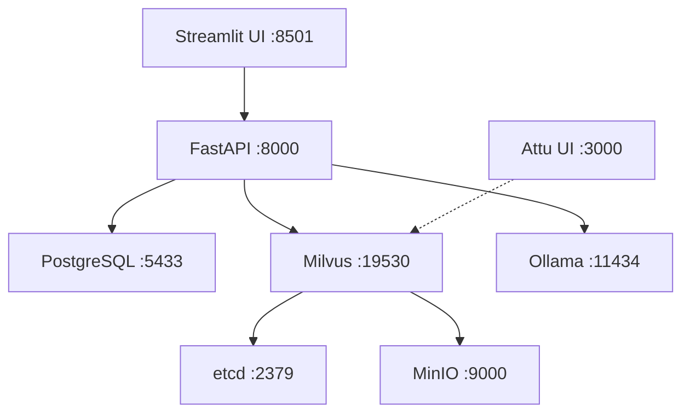

# 🚀 RAG V2 Ultimate - Quick Reference Card

## Essential Commands

### 🏁 Startup

```bash
# Automated setup (recommended for first time)
chmod +x setup.sh && ./setup.sh

# Manual start
docker-compose up -d

# Start with logs visible
docker-compose up

# Rebuild and start
docker-compose up -d --build
```

### 🛑 Shutdown

```bash
# Stop (preserves data)
docker-compose down

# Stop and remove volumes (⚠️ DELETES ALL DATA)
docker-compose down -v

# Stop specific service
docker-compose stop api
```

### 🔄 Restart

```bash
# Restart all
docker-compose restart

# Restart specific service
docker-compose restart api
docker-compose restart postgres
docker-compose restart milvus
```

### 📊 Monitoring

```bash
# View all logs (live)
docker-compose logs -f

# View specific service logs
docker-compose logs -f api
docker-compose logs -f postgres

# Last 100 lines
docker-compose logs --tail=100 api

# Service status
docker-compose ps

# System health check
curl http://localhost:8000/health | jq
```

### 🔍 Debugging

```bash
# Enter container shell
docker exec -it rag_api bash
docker exec -it rag_postgres bash

# Check PostgreSQL
docker exec -it rag_postgres psql -U rag_user -d rag_db

# Check database tables
docker exec -it rag_postgres psql -U rag_user -d rag_db -c "\dt"

# Check Milvus collections
curl -X GET "http://localhost:9091/api/v1/collections" | jq

# Check GPU in container
docker exec -it rag_api nvidia-smi

# Check Ollama models
docker exec -it rag_ollama ollama list
```

## Access URLs

| Service | URL | Credentials |
|---------|-----|-------------|
| **Main UI** | http://localhost:8501 | - |
| **API Docs** | http://localhost:8000/docs | - |
| **API Health** | http://localhost:8000/health | - |
| **Milvus Admin** | http://localhost:3000 | - |
| **MinIO Console** | http://localhost:9001 | admin / minioadmin |

## Database Access

### PostgreSQL

```bash
# Connect via psql
docker exec -it rag_postgres psql -U rag_user -d rag_db

# Common queries
SELECT * FROM file_registry;
SELECT * FROM v_file_stats;
SELECT * FROM chat_sessions ORDER BY updated_at DESC LIMIT 10;
SELECT COUNT(*) FROM document_chunks;

# Backup database
docker exec -t rag_postgres pg_dump -U rag_user rag_db > backup.sql

# Restore database
docker exec -i rag_postgres psql -U rag_user -d rag_db < backup.sql
```

### Milvus

```bash
# Via Python
docker exec -it rag_api python3 << 'EOF'
from pymilvus import connections, Collection
connections.connect(host="milvus", port="19530")
collection = Collection("rag_collection_v2_hnsw")
print(f"Total vectors: {collection.num_entities}")
EOF
```

## File Management

### Upload Document

```bash
# Via UI: Use sidebar file uploader

# Via API
curl -X POST "http://localhost:8000/files/upload" \
  -F "file=@document.pdf"
```

### Check Processing Status

```bash
# Via API
curl http://localhost:8000/files/status | jq

# Expected output:
# {
#   "total": 5,
#   "completed": 3,
#   "pending": 2,
#   "failed": 0
# }
```

### Delete File

```bash
# Via API (get file_id from /files endpoint)
curl -X DELETE "http://localhost:8000/files/{file_id}"
```

## Chat Operations

### Create Session

```bash
curl -X POST "http://localhost:8000/sessions" \
  -H "Content-Type: application/json" \
  -d '{"title": "Financial Analysis"}'
```

### Send Message

```bash
curl -X POST "http://localhost:8000/sessions/{session_id}/message" \
  -H "Content-Type: application/json" \
  -d '{
    "content": "What is the revenue trend?",
    "use_rag": true
  }' | jq
```

### List Sessions

```bash
curl http://localhost:8000/sessions | jq
```

## Environment Variables

### Critical Settings

```bash
# View current config
docker exec -it rag_api env | grep -E "GOOGLE_API_KEY|MILVUS|POSTGRES"

# Edit .env file
nano .env

# Apply changes (restart services)
docker-compose down
docker-compose up -d
```

### Key Variables

| Variable | Purpose | Example |
|----------|---------|---------|
| `GOOGLE_API_KEY` | Gemini API (primary LLM) | `AIza...` |
| `EMBEDDING_BATCH_SIZE` | GPU batch size | `64` (16GB GPU) / `32` (12GB) |
| `POSTGRES_PASSWORD` | Database password | Auto-generated |
| `ENABLE_HYBRID_SEARCH` | Use vector + keyword | `true` |
| `ENABLE_RERANKING` | Cross-encoder reranking | `true` |

## Volume Management

### List Volumes

```bash
docker volume ls | grep rag
```

### Inspect Volume

```bash
docker volume inspect rag-v2-ultimate_postgres_data
```

### Backup Volumes

```bash
# Backup PostgreSQL volume
docker run --rm \
  -v rag-v2-ultimate_postgres_data:/data \
  -v $(pwd):/backup \
  ubuntu tar czf /backup/postgres_backup.tar.gz /data

# Backup all volumes
for vol in postgres_data milvus_data api_data; do
  docker run --rm \
    -v rag-v2-ultimate_$vol:/data \
    -v $(pwd):/backup \
    ubuntu tar czf /backup/${vol}_backup.tar.gz /data
done
```

### Restore Volumes

```bash
docker run --rm \
  -v rag-v2-ultimate_postgres_data:/data \
  -v $(pwd):/backup \
  ubuntu tar xzf /backup/postgres_backup.tar.gz -C /
```

### Clean Volumes (⚠️ DANGER)

```bash
# Remove all RAG volumes
docker-compose down -v

# Remove all unused volumes
docker volume prune -f
```

## Performance Tuning

### GPU Optimization

```bash
# Check GPU utilization
watch -n 1 nvidia-smi

# Adjust batch size based on VRAM
# Edit .env:
EMBEDDING_BATCH_SIZE=64  # 16GB GPU
EMBEDDING_BATCH_SIZE=32  # 12GB GPU
EMBEDDING_BATCH_SIZE=16  # 8GB GPU

# Restart API
docker-compose restart api
```

### Database Optimization

```bash
# Analyze tables
docker exec -it rag_postgres psql -U rag_user -d rag_db -c "ANALYZE;"

# Vacuum database
docker exec -it rag_postgres psql -U rag_user -d rag_db -c "VACUUM FULL;"

# Check index usage
docker exec -it rag_postgres psql -U rag_user -d rag_db -c "
SELECT schemaname, tablename, indexname, idx_scan 
FROM pg_stat_user_indexes 
ORDER BY idx_scan DESC;"
```

## Common Issues Quick Fix

| Issue | Quick Fix |
|-------|-----------|
| Services not starting | `docker-compose down && docker-compose up -d` |
| PostgreSQL connection failed | Wait 30s, retry |
| Milvus not ready | `docker-compose restart etcd minio milvus` |
| GPU not detected | Check nvidia-container-toolkit installation |
| Out of memory | Reduce `EMBEDDING_BATCH_SIZE` |
| Slow embedding | Increase `EMBEDDING_BATCH_SIZE` |
| API import errors | `docker-compose build --no-cache api` |
| Database schema missing | Check `init-db.sql` is in project root |

## System Health Indicators

### Healthy System

```bash
curl http://localhost:8000/health
# {
#   "postgres": "ok",
#   "milvus": "ok", 
#   "models": "ok",
#   "internet": "ok"
# }

docker-compose ps
# All services: Up (healthy)
```

### Unhealthy System

```bash
# Check logs for errors
docker-compose logs --tail=50 api
docker-compose logs --tail=50 postgres

# Restart unhealthy service
docker-compose restart api
```

## Update & Maintenance

### Update Code

```bash
# Pull latest changes
git pull

# Rebuild containers
docker-compose build --no-cache

# Restart with new code
docker-compose down
docker-compose up -d
```

### Update Dependencies

```bash
# Edit requirements.txt
nano api/requirements.txt

# Rebuild API
docker-compose build --no-cache api
docker-compose up -d api
```

### Clean Build

```bash
# Stop everything
docker-compose down

# Remove images
docker-compose down --rmi all

# Remove volumes (⚠️ data loss)
docker-compose down -v

# Fresh rebuild
docker-compose build --no-cache
docker-compose up -d
```

---

## 🆘 Emergency Commands

```bash
# Nuclear option: Remove everything
docker-compose down -v --rmi all
docker system prune -af --volumes

# Fresh start
./setup.sh
```

---

**💡 Pro Tip**: Keep this file bookmarked for quick reference!

# 📁 RAG V2 Ultimate - Complete Project Structure

## Directory Layout

```
rag-v2-ultimate/
│
├── 📄 docker-compose.yml          # Service orchestration (ALL services)
├── 📄 init-db.sql                 # PostgreSQL schema initialization
├── 📄 .env                        # Environment variables (CREATE THIS)
├── 📄 .env.example                # Environment template
├── 📄 setup.sh                    # Automated setup script
├── 📄 README.md                   # Main documentation
├── 📄 PROJECT_STRUCTURE.md        # This file
│
├── 📁 api/                        # Backend service
│   ├── 📄 Dockerfile              # API container definition
│   ├── 📄 requirements.txt        # Python dependencies
│   │
│   └── 📁 app/                    # Application code
│       ├── 📄 __init__.py         # Package initialization
│       ├── 📄 main.py             # FastAPI gateway (entry point)
│       ├── 📄 database.py         # PostgreSQL operations
│       ├── 📄 rag_core.py         # RAG engine (search + LLM)
│       └── 📄 ingest.py           # Document processing pipeline
│
├── 📁 ui/                         # Frontend service
│   ├── 📄 Dockerfile              # UI container definition
│   ├── 📄 requirements.txt        # Streamlit dependencies
│   └── 📄 app.py                  # Streamlit interface
│
└── 📁 volumes/                    # Docker named volumes (auto-created)
    ├── 📁 postgres/               # PostgreSQL data (MANAGED BY DOCKER)
    ├── 📁 etcd/                   # Milvus metadata (MANAGED BY DOCKER)
    ├── 📁 minio/                  # Milvus object storage (MANAGED BY DOCKER)
    └── 📁 milvus/                 # Milvus vector data (MANAGED BY DOCKER)
```

## File Descriptions

### Root Level

| File | Purpose | Required |
|------|---------|----------|
| `docker-compose.yml` | Defines all 7 services (postgres, milvus, ollama, api, ui, attu, etcd, minio) | ✅ Yes |
| `init-db.sql` | Database schema, triggers, indexes, views | ✅ Yes |
| `.env` | Environment variables (passwords, API keys) | ✅ Yes (create from .env.example) |
| `.env.example` | Template for environment configuration | ✅ Yes |
| `setup.sh` | Automated setup and health check script | ⭐ Recommended |
| `README.md` | Complete documentation | ⭐ Recommended |

### API Service (`api/`)

| File | Purpose | Key Functions |
|------|---------|---------------|
| `Dockerfile` | CUDA-enabled container with Python 3.10 | - |
| `requirements.txt` | FastAPI, psycopg2, pymilvus, sentence-transformers, etc. | - |
| `app/__init__.py` | Package metadata | - |
| `app/main.py` | FastAPI application, all endpoints | `startup_event()`, `health_check()`, `send_message()` |
| `app/database.py` | Connection pooling, CRUD operations | `DatabaseManager`, `FileRegistry`, `ChatSessions`, `ChatEvents` |
| `app/rag_core.py` | Search, embedding, reranking, LLM | `RAGEngine`, `MilvusStore`, `EmbeddingService`, `Reranker` |
| `app/ingest.py` | PDF processing, chunking, dual ingestion | `IngestionPipeline`, `extract_text_from_pdf()` |

### UI Service (`ui/`)

| File | Purpose | Key Features |
|------|---------|--------------|
| `Dockerfile` | Lightweight Python container | - |
| `requirements.txt` | Streamlit, requests | - |
| `app.py` | Complete UI with loading screen, chat, file manager | `show_loading_screen()`, chat interface, sidebar |

## Volume Management

### Named Volumes (Docker-Managed)

These are **automatically created** by Docker and should **NOT** be created manually:

```yaml
volumes:
  postgres_data:     # PostgreSQL database
  etcd_data:         # Milvus metadata store
  minio_data:        # Milvus object storage
  milvus_data:       # Milvus vector indexes
  ollama_data:       # Ollama models
  api_data:          # Uploaded files
  api_logs:          # Application logs
```

### Volume Lifecycle

- **Created**: Automatically on `docker-compose up`
- **Persisted**: Data survives container restarts
- **Destroyed**: Only with `docker-compose down -v` (⚠️ loses all data)

### Access Volume Data

```bash
# List all volumes
docker volume ls

# Inspect volume location
docker volume inspect rag-v2-ultimate_postgres_data

# Backup a volume
docker run --rm -v rag-v2-ultimate_postgres_data:/data -v $(pwd):/backup ubuntu tar czf /backup/postgres_backup.tar.gz /data

# Restore a volume
docker run --rm -v rag-v2-ultimate_postgres_data:/data -v $(pwd):/backup ubuntu tar xzf /backup/postgres_backup.tar.gz -C /
```

## Service Dependencies



## Port Mapping

| Service | Internal Port | External Port | Purpose |
|---------|---------------|---------------|---------|
| Streamlit UI | 8501 | 8501 | Main application interface |
| FastAPI | 8000 | 8000 | REST API |
| PostgreSQL | 5432 | 5433 | Database (offset to avoid conflicts) |
| Milvus | 19530 | 19530 | Vector search |
| Milvus Admin | 9091 | 9091 | Milvus health endpoint |
| Ollama | 11434 | 11435 | Local LLM & embeddings |
| Attu (Milvus UI) | 3000 | 3000 | Vector DB admin panel |
| MinIO Console | 9001 | 9001 | Object storage admin |
| MinIO API | 9000 | 9003 | Object storage API |
| etcd | 2379 | - | Metadata (internal only) |

## Critical Files Checklist

Before running `docker-compose up`, ensure these files exist:

### Backend Files (ALL REQUIRED)

- [ ] `api/Dockerfile`
- [ ] `api/requirements.txt`
- [ ] `api/app/__init__.py`
- [ ] `api/app/main.py`
- [ ] `api/app/database.py`
- [ ] `api/app/rag_core.py`
- [ ] `api/app/ingest.py`

### Frontend Files (ALL REQUIRED)

- [ ] `ui/Dockerfile`
- [ ] `ui/requirements.txt`
- [ ] `ui/app.py`

### Configuration Files (ALL REQUIRED)

- [ ] `docker-compose.yml`
- [ ] `init-db.sql`
- [ ] `.env` (created from `.env.example`)

## Quick Start Checklist

1. ✅ Clone repository
2. ✅ Verify all files present (see checklist above)
3. ✅ Copy `.env.example` to `.env`
4. ✅ Edit `.env` and add `GOOGLE_API_KEY`
5. ✅ Ensure Docker & nvidia-container-toolkit installed
6. ✅ Run `bash setup.sh` OR `docker-compose up -d`
7. ✅ Wait ~2 minutes for services to initialize
8. ✅ Access http://localhost:8501

## Common Issues & Solutions

### "init-db.sql not found"

```bash
# Verify file exists in root directory
ls -la init-db.sql

# If missing, ensure it's in project root, not in api/ or ui/
```

### "Volume permission denied"

```bash
# Fix permissions (Linux)
sudo chown -R $USER:$USER volumes/

# Or run with sudo
sudo docker-compose up -d
```

### "GPU not detected in containers"

```bash
# Test GPU access
docker run --rm --gpus all nvidia/cuda:12.2.0-base-ubuntu22.04 nvidia-smi

# If fails, reinstall nvidia-container-toolkit
sudo apt-get install -y nvidia-container-toolkit
sudo systemctl restart docker
```

### "Services keep restarting"

```bash
# Check logs
docker-compose logs api
docker-compose logs postgres

# Common cause: missing .env file
ls -la .env
```

## Development Workflow

### Edit Code

```bash
# API code changes (auto-reload with volume mount)
nano api/app/main.py

# UI code changes (auto-reload with volume mount)
nano ui/app.py

# Restart specific service to apply changes
docker-compose restart api
docker-compose restart ui
```

### Rebuild After Dependencies Change

```bash
# After modifying requirements.txt
docker-compose build api
docker-compose up -d api
```

### Clean Restart

```bash
# Stop everything
docker-compose down

# Remove volumes (⚠️ deletes all data)
docker-compose down -v

# Rebuild and start fresh
docker-compose build --no-cache
docker-compose up -d
```

## Monitoring & Logs

```bash
# All services
docker-compose logs -f

# Specific service
docker-compose logs -f api
docker-compose logs -f postgres

# Last 100 lines
docker-compose logs --tail=100 api

# Service status
docker-compose ps
```

---

**Pro Tip**: Use `bash setup.sh` for automated setup with health checks! 🚀